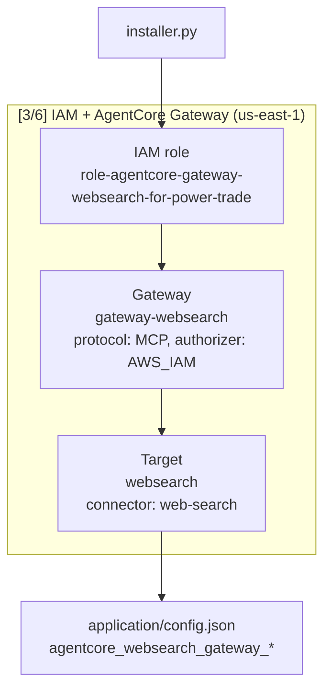
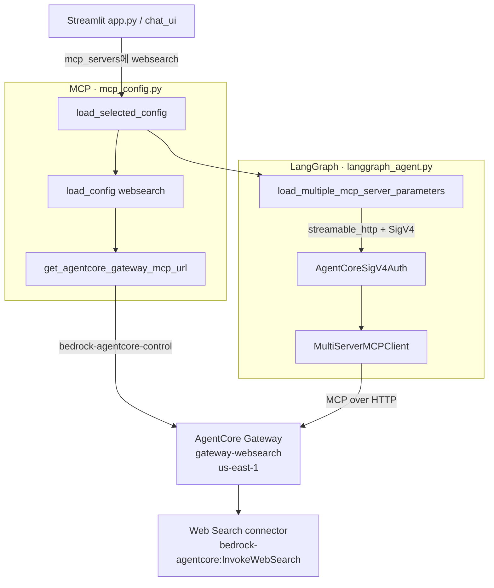

# AgentCore Web Search (websearch) 구현

power-agent는 **Amazon Bedrock AgentCore Gateway**의 관리형 Web Search 커넥터(`gateway-websearch`)를 MCP 도구로 연결하여, Tavily·`web_fetch`와 함께 인터넷 검색을 수행할 수 있습니다. Gateway 인프라는 [installer.py](./installer.py)로 자동 생성하거나, 이미 존재하는 Gateway를 재사용할 수 있습니다. Application 레이어([mcp_config.py](./application/mcp_config.py), [langgraph_agent.py](./application/langgraph_agent.py))는 Gateway URL을 런타임에 조회해 SigV4로 MCP에 연결합니다.

## Infrastructure 배포 (installer.py)

[installer.py](./installer.py)는 Knowledge Base·S3·CloudFront와 함께 **AgentCore Web Search Gateway**를 `us-east-1`에 프로비저닝합니다. Gateway는 애플리케이션 리전(`us-west-2`)과 분리된 **고정 리전**에 생성됩니다.



### installer가 생성하는 websearch 리소스

| 리소스 | 이름/값 | 리전 | 설명 |
|--------|---------|------|------|
| IAM 역할 | `role-agentcore-gateway-websearch-for-power-trade` | 글로벌 | Gateway 서비스 역할 (`bedrock-agentcore.amazonaws.com`) |
| Gateway | `gateway-websearch` | `us-east-1` | MCP 프로토콜, `AWS_IAM` 인증 |
| Gateway Target | `websearch` | `us-east-1` | 관리형 커넥터 `web-search` (`GATEWAY_IAM_ROLE`) |
| IAM 정책 | `agentcore-gateway-websearch-policy-for-power-trade` | — | `InvokeGateway`, `InvokeWebSearch` |

Gateway IAM 역할 정책은 다음을 허용합니다.

- `bedrock-agentcore:InvokeGateway` — 계정 내 Gateway MCP 엔드포인트
- `bedrock-agentcore:InvokeWebSearch` — `arn:aws:bedrock-agentcore:us-east-1:aws:tool/web-search.v1`

### installer 실행 순서 (websearch 관련)

전체 installer는 6단계이며, websearch는 **3단계**에서 Knowledge Base IAM 역할과 함께 생성됩니다.

| 단계 | 작업 | websearch 관련 |
|------|------|----------------|
| 2/6 | S3 버킷 | — |
| **3/6** | IAM 역할 + AgentCore Gateway | Gateway 역할 → `gateway-websearch` → `websearch` target |
| 4/6 | S3 Vectors | — |
| 5/6 | Knowledge Base | — |
| 6/6 | CloudFront | — |

```bash
cd power-agent
python3 installer.py
```

성공 시 로그에 Gateway ID·URL·역할 ARN이 출력되고, `application/config.json`에 아래 필드가 기록됩니다.

| config.json 필드 | 예시 | 용도 |
|------------------|------|------|
| `agentcore_websearch_gateway_name` | `gateway-websearch` | Gateway 이름 |
| `agentcore_websearch_gateway_region` | `us-east-1` | Gateway 리전 |
| `agentcore_websearch_gateway_id` | `gw-...` | Gateway 식별자 |
| `agentcore_websearch_gateway_url` | `https://...` | MCP 엔드포인트 URL |
| `agentcore_websearch_gateway_role` | `arn:aws:iam::...:role/...` | Gateway 서비스 역할 ARN |

> **참고:** Application([mcp_config.py](./application/mcp_config.py))은 `config.json`의 URL을 직접 읽지 않고, `bedrock-agentcore-control` API로 `gateway-websearch`를 조회합니다. config 필드는 운영·디버깅용 참조입니다.

### 멱등성 (재실행)

installer는 이미 존재하는 리소스를 건너뜁니다.

- `gateway-websearch` Gateway가 있으면 **재생성하지 않고** 기존 Gateway 사용
- `websearch` target이 없으면 추가 생성 후 `synchronize_gateway_targets` 호출
- IAM 역할이 있으면 기존 역할 ARN 반환

동일 AWS 계정에서 여러 프로젝트 installer를 실행해도 Gateway 이름(`gateway-websearch`)이 같으면 **하나의 Gateway를 공유**합니다.

### installer 핵심 코드

Gateway는 `bedrock-agentcore-control` 클라이언트(`us-east-1`)로 생성합니다. Target은 관리형 `web-search` 커넥터를 MCP 타깃으로 등록합니다.

```python
# installer.py — get_or_create_agentcore_websearch_gateway() 요약
response = agentcore_control_client.create_gateway(
    name="gateway-websearch",
    description="AgentCore Web Search gateway for power-trade",
    roleArn=gateway_service_role_arn,
    protocolType="MCP",
    authorizerType="AWS_IAM",
    tags={"project": "power-trade"},
)
gateway_id = response["gatewayId"]
wait_for_agentcore_gateway_ready(gateway_id)

response = agentcore_control_client.create_gateway_target(
    gatewayIdentifier=gateway_id,
    name="websearch",
    targetConfiguration={
        "mcp": {
            "connector": {
                "source": {"connectorId": "web-search"},
                "configurations": [{"name": "WebSearch", "parameterValues": {}}],
            }
        }
    },
    credentialProviderConfigurations=[
        {"credentialProviderType": "GATEWAY_IAM_ROLE"}
    ],
)
agentcore_control_client.synchronize_gateway_targets(
    gatewayIdentifier=gateway_id,
    targetIdList=[response["targetId"]],
)
```

### Gateway 삭제 (uninstaller.py)

[uninstaller.py](./uninstaller.py)는 Gateway 삭제를 **기본적으로 묻고, 기본 답은 no**입니다. Gateway를 유지하면 IAM 역할(`role-agentcore-gateway-websearch-for-power-trade`)도 함께 보존됩니다.

```bash
# Gateway 삭제 확인 프롬프트 표시 (기본: no)
python3 uninstaller.py --yes

# Gateway 삭제 확인 없이 함께 삭제
python3 uninstaller.py --yes --delete-agentcore-gateway
```

삭제 순서: Knowledge Base → S3 Vectors → **AgentCore Gateway**(target 먼저) → IAM 역할 → `config.json`의 `agentcore_websearch_gateway_*` 필드 제거

## Operation Architecture



| 구성요소 | 파일 | 설명 |
|----------|------|------|
| UI 선택 | [app.py](./application/app.py), [chat_ui/app.py](./chat_ui/app.py) | Agent 모드 MCP 체크박스에 `websearch` 포함, 기본 선택 |
| MCP 설정 | [mcp_config.py](./application/mcp_config.py) | Gateway URL 조회 및 `streamable_http` + SigV4 메타데이터 반환 |
| MCP 클라이언트 | [langgraph_agent.py](./application/langgraph_agent.py) | `MultiServerMCPClient`용 connection dict 생성, SigV4 auth 주입 |
| SigV4 인증 | [agentcore_sigv4_auth.py](./application/agentcore_sigv4_auth.py) | httpx 요청에 `bedrock-agentcore` 서비스 SigV4 서명 |

| MCP | transport | 인증 | 비고 |
|-----|-----------|------|------|
| **websearch** | `streamable_http` | AWS SigV4 (`us-east-1`) | AgentCore 관리형 Web Search |
| tavily | stdio | Tavily API Key | 로컬 Python MCP 서버 |
| web_fetch | stdio | 없음 | URL 본문 fetch (npx) |

## Agent에서의 사용 흐름

[app.py](./application/app.py)에서 Agent 모드일 때 사용자가 선택한 MCP 목록(`mcp_servers`)에 `"websearch"`가 포함되면, [chat.py](./application/chat.py)의 `run_langgraph_agent()` → `create_agent()` 경로로 전달됩니다. Agent 생성 시 `load_selected_config()`로 MCP 설정을 병합하고, `MultiServerMCPClient`가 도구 목록을 LangGraph `ToolNode`에 등록합니다.

Streamlit sidebar 기본 MCP 선택은 아래와 같습니다.

```python
mcp_options = [
    "tavily",
    "websearch",
    "knowledge base",
    "aws documentation",
    "trade info",
    "weather",
    "noaa",
    "web_fetch",
    "image generation",
    "사용자 설정"
]
default_selections = ["knowledge base", "web_fetch", "websearch"]
```

Flask [chat_ui/app.py](./chat_ui/app.py)도 동일하게 `websearch`를 `DEFAULT_MCP_SERVERS`에 포함합니다.

## MCP 구현

[mcp_config.py](./application/mcp_config.py)에서 `websearch` 타입은 stdio 서버가 아니라 **AgentCore Gateway MCP 엔드포인트**를 가리킵니다. Gateway URL은 `bedrock-agentcore-control` API로 런타임에 조회합니다.

```python
def get_agentcore_gateway_mcp_url(gateway_name: str, gateway_region: str) -> str | None:
    client = boto3.client("bedrock-agentcore-control", region_name=gateway_region)
    try:
        response = client.list_gateways()
        for item in response.get("items", []):
            if item.get("name") != gateway_name:
                continue
            gateway_id = item["gatewayId"]
            gateway = client.get_gateway(gatewayIdentifier=gateway_id)
            return gateway["gatewayUrl"].rstrip("/")
    except Exception as e:
        logger.error(f"Error resolving AgentCore gateway URL for {gateway_name}: {e}")
    return None
```

`load_config("websearch")`는 `gateway-websearch`가 **us-east-1**에 존재할 때만 설정을 반환합니다. 없으면 빈 dict를 반환하고 해당 MCP는 건너뜁니다.

```python
elif mcp_type == "websearch":
    gateway_url = get_agentcore_gateway_mcp_url("gateway-websearch", "us-east-1")
    if not gateway_url:
        logger.info(
            "AgentCore gateway websearch MCP skipped: "
            "gateway-websearch not found in us-east-1."
        )
        return {}
    return {
        "mcpServers": {
            "gateway-websearch": {
                "type": "streamable_http",
                "url": gateway_url,
                "auth_type": "aws_sigv4",
                "auth_region": "us-east-1",
                "auth_service": "bedrock-agentcore",
            }
        }
    }
```

| 필드 | 값 | 의미 |
|------|-----|------|
| `type` | `streamable_http` | MCP Streamable HTTP transport |
| `url` | Gateway MCP URL | `get_gateway()`의 `gatewayUrl` |
| `auth_type` | `aws_sigv4` | IAM 자격 증명으로 요청 서명 |
| `auth_region` | `us-east-1` | Gateway 리전 (고정) |
| `auth_service` | `bedrock-agentcore` | SigV4 서비스 이름 |

## LangGraph MCP 클라이언트 연동

[langgraph_agent.py](./application/langgraph_agent.py)의 `load_multiple_mcp_server_parameters()`는 `mcp_config` 출력을 [langchain-mcp-adapters](https://reference.langchain.com/python/langchain-mcp-adapters/client/MultiServerMCPClient) 형식으로 변환합니다. `streamable_http` 타입이면서 `auth_type == "aws_sigv4"`인 경우 SigV4 auth 객체를 connection에 붙입니다.

```python
def load_multiple_mcp_server_parameters(mcp_json: dict):
    mcpServers = mcp_json.get("mcpServers")
    server_info = {}
    if mcpServers is not None:
        for server_name, cfg in mcpServers.items():
            if cfg.get("type") in ("streamable_http", "http"):
                connection = {
                    "transport": "streamable_http",
                    "url": cfg.get("url"),
                    "headers": cfg.get("headers", {})
                }
                if cfg.get("auth_type") == "aws_sigv4":
                    connection["auth"] = agentcore_sigv4_auth.AgentCoreSigV4Auth(
                        region=cfg.get("auth_region", "us-east-1"),
                        service=cfg.get("auth_service", "bedrock-agentcore"),
                    )
                server_info[server_name] = connection
            else:
                server_info[server_name] = {
                    "transport": "stdio",
                    "command": cfg.get("command", ""),
                    "args": cfg.get("args", []),
                    "env": cfg.get("env", {}),
                }
    return server_info
```

[chat.py](./application/chat.py)의 `create_agent()`는 이 connection dict로 `MultiServerMCPClient`를 만들고 `get_tools()`로 LangGraph 도구를 등록합니다.

```python
mcp_json = mcp_config.load_selected_config(mcp_servers)
server_params = langgraph_agent.load_multiple_mcp_server_parameters(mcp_json)
client = MultiServerMCPClient(server_params)
mcp_tools = await client.get_tools()
tools.append(mcp_tools)
```

## SigV4 인증

[agentcore_sigv4_auth.py](./application/agentcore_sigv4_auth.py)는 httpx `Auth` 구현체입니다. boto3 세션의 현재 IAM 자격 증명으로 Gateway MCP URL에 대한 요청을 `bedrock-agentcore` 서비스 SigV4로 서명합니다.

```python
class AgentCoreSigV4Auth(httpx.Auth):
    def __init__(self, region: str, service: str = "bedrock-agentcore"):
        self.region = region
        self.service = service

    def auth_flow(self, request: httpx.Request):
        credentials = boto3.Session().get_credentials().get_frozen_credentials()
        aws_request = AWSRequest(
            method=request.method,
            url=str(request.url),
            data=request.content,
            headers=dict(request.headers),
        )
        SigV4Auth(credentials, self.service, self.region).add_auth(aws_request)
        prepared = aws_request.prepare()
        for key, value in prepared.headers.items():
            request.headers[key] = value
        yield request
```

로컬 개발·EC2·컨테이너 모두 **실행 환경의 AWS credential**(프로파일, instance role, 환경 변수 등)이 Gateway 호출 권한을 가져야 합니다.

## 사전 준비

### 권장: installer로 Gateway 생성

```bash
cd power-agent
python3 installer.py
```

installer 실행 주체(IAM 사용자·역할)에는 최소 다음 권한이 필요합니다.

| API | 용도 |
|-----|------|
| `bedrock-agentcore-control:CreateGateway`, `CreateGatewayTarget`, `ListGateways`, `GetGateway`, `SynchronizeGatewayTargets` | Gateway·Target 생성 (installer, `us-east-1`) |
| `iam:CreateRole`, `PutRolePolicy`, `AttachRolePolicy` | Gateway 서비스 역할 |
| `bedrock-agentcore:InvokeGateway`, `bedrock-agentcore:InvokeWebSearch` | Agent 런타임에서 MCP 호출 |
| `bedrock-agentcore-control:ListGateways`, `GetGateway` | URL 조회 ([mcp_config.py](./application/mcp_config.py)) |

### 대안: 기존 Gateway 재사용

다른 프로젝트 installer로 이미 `gateway-websearch`(`us-east-1`)가 있으면 power-agent installer를 실행하지 않아도 됩니다. Application은 API로 Gateway URL을 조회하므로 config에 websearch 필드가 없어도 동작합니다.

수동 생성이 필요한 경우 AWS 콘솔 또는 `bedrock-agentcore-control` API로 Gateway + `web-search` 커넥터 target을 `us-east-1`에 구성합니다.

`aws configure` 또는 EC2 instance role로 credential을 설정한 뒤 Agent를 실행합니다.

## Tavily / web_fetch 와의 차이

| 항목 | websearch (AgentCore) | tavily | web_fetch |
|------|------------------------|--------|-----------|
| 백엔드 | Bedrock AgentCore Web Search | Tavily Search API | URL 직접 fetch |
| API Key | 불필요 (IAM) | `TAVILY_API_KEY` 필요 | 불필요 |
| Gateway | `us-east-1` 필수 | 없음 | 없음 |
| transport | streamable HTTP + SigV4 | stdio | stdio |

전력 거래·에너지 뉴스 조사처럼 **최신 웹 검색**이 필요할 때 `websearch`를 기본 MCP로 두고, 특정 URL 본문이 필요하면 `web_fetch`, Tavily 전용 검색이 필요하면 `tavily`를 함께 선택할 수 있습니다.

## 실행

[README.md](./README.md)의 설치·실행 절차와 동일합니다. Gateway가 없으면 `python3 installer.py`로 생성하거나, 로그에 `gateway-websearch not found in us-east-1`이 출력되며 websearch MCP만 제외됩니다.

```bash
streamlit run application/app.py
```

Agent 모드에서 sidebar **MCP Config** → **websearch** 체크 후, 예를 들어 아래와 같이 질의합니다.

```text
최근 전력 시장 규제 변경 사항을 websearch로 조사해 요약하세요.
```

## 관련 파일

| 파일 | 역할 |
|------|------|
| [installer.py](./installer.py) | Gateway IAM 역할·`gateway-websearch`·`websearch` target 생성, `config.json` 기록 |
| [uninstaller.py](./uninstaller.py) | Gateway·target 삭제 (`--delete-agentcore-gateway`) |
| [application/mcp_config.py](./application/mcp_config.py) | websearch MCP 정의, Gateway URL 조회 |
| [application/langgraph_agent.py](./application/langgraph_agent.py) | SigV4 connection 변환 |
| [application/agentcore_sigv4_auth.py](./application/agentcore_sigv4_auth.py) | httpx SigV4 auth |
| [application/app.py](./application/app.py) | Streamlit MCP UI |
| [chat_ui/app.py](./chat_ui/app.py) | Flask chat UI 기본 MCP |
